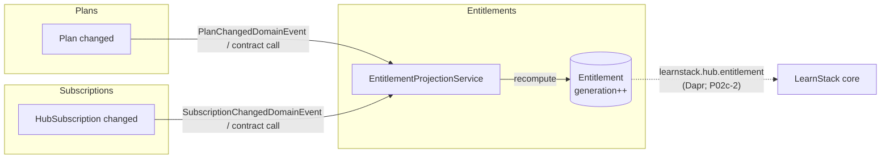

# Hub module topology

This document is the design spec for the Hub modular monolith as it stands after **P02c-1 (Hub Domain Core)**. It describes the four modules that land in P02c-1, the dependency direction rules, and how cross-module communication works inside Hub. Modules that arrive in later packets (CustomDomains, Compliance, Usage, LicenseKeys, Audit, Operators, Invoicing) are listed for context but specced in their own packets.

Authoritative cross-cutting sources: [ADR-0019 § Hub data model](https://github.com/cemililik/LearnStack/blob/main/docs/decisions/0019-learnstack-hub.md), [Architecture 24 § 2 / § 7](https://github.com/cemililik/LearnStack/blob/main/docs/architecture/24-learnstack-hub.md), [ADR-0010 Cross-Module Communication](https://github.com/cemililik/LearnStack/blob/main/docs/decisions/0010-cross-module-communication.md).

## Modules in P02c-1

| Module                                   | Aggregate(s)       | DbContext                  | Owns                                                                                         |
| ---------------------------------------- | ------------------ | -------------------------- | -------------------------------------------------------------------------------------------- |
| `LearnStack.Hub.Modules.TenantLifecycle` | `LearnStackTenant` | `TenantLifecycleDbContext` | The Hub-side mirror of LearnStack's `Tenant`; status state machine; deployment-mode tracking |
| `LearnStack.Hub.Modules.Plans`           | `Plan`             | `PlansDbContext`           | Plan catalogue; feature / limit / compliance defaults                                        |
| `LearnStack.Hub.Modules.Subscriptions`   | `HubSubscription`  | `SubscriptionsDbContext`   | Per-tenant plan binding; subscription lifecycle state machine                                |
| `LearnStack.Hub.Modules.Entitlements`    | `Entitlement`      | `EntitlementsDbContext`    | The flattened projection of Plan + Subscription (+ compliance, later); `generation` counter  |

Each module follows LearnStack core's four-project layout:

```
src/Modules/<Name>/
├── LearnStack.Hub.Modules.<Name>.Domain/             # aggregate, value objects, domain events
├── LearnStack.Hub.Modules.<Name>.Application.Contracts/ # commands, queries, DTOs
├── LearnStack.Hub.Modules.<Name>.Application/         # MediatR handlers, validators
└── LearnStack.Hub.Modules.<Name>.Infrastructure/     # DbContext, EF configs, repositories
```

## Dependency direction

Identical rules to LearnStack core (enforced by `ModuleDependencyTests`):

- `Domain` may reference **only** `LearnStack.Hub.SharedKernel` (+ the Hub analyzer if one ships).
- `Domain` of module X may **never** reference `Domain` of module Y.
- `Application.Contracts` references `SharedKernel` only.
- `Application` references its own `Domain` + `Application.Contracts` + `SharedKernel` + MediatR + FluentValidation.
- `Infrastructure` references its own `Domain` + `Application` + `SharedKernel` + EF Core.
- No module references `LearnStack.Domain` / `LearnStack.Infrastructure` / `LearnStack.Modules.*` from LearnStack core (enforced by `Hub_Modules_DoNotReference_LearnStack_Internals`; trivially true today since Hub has zero LearnStack references).

## Cross-module communication

Hub uses the same four mechanisms as LearnStack core ([ADR-0010](https://github.com/cemililik/LearnStack/blob/main/docs/decisions/0010-cross-module-communication.md)) — no fifth:

1. **Application contract** — synchronous in-process call to another module's `Application.Contracts` interface.
2. **Intra-module domain event** — `IDomainEvent : INotification`, dispatched in-process via MediatR inside the same transaction.
3. **Integration event via outbox** — versioned event, written to the outbox in the same DbContext transaction, dispatched through Dapr pub/sub. (Outbox infra lands fully in P02c-2; P02c-1 may stub `IOutbox` as a no-op shell mirroring LearnStack's `OutboxFlushBehavior` shell.)
4. **Read-model projection** — `Entitlement` is itself the canonical example: a flattened read model rebuilt from `Plan` + `HubSubscription`.

### P02c-1 cross-module flow: entitlement rebuild

The single load-bearing cross-module flow in P02c-1 is the **entitlement rebuild**:



In P02c-1 the trigger is an **in-process call** from the Subscriptions / Plans handlers into the Entitlements module's projection service (mechanism 1 or 2). The Dapr publish of `learnstack.hub.entitlement` (mechanism 3) is **stubbed** in P02c-1 and lit up in P02c-2 alongside the outbound `LearnStackApiClient`. See [entitlement-projection.md](entitlement-projection.md) for the recompute algorithm + `generation` semantics.

## Database isolation model — Hub does NOT use RLS

This is the load-bearing difference from LearnStack core. LearnStack core enforces tenant isolation with PostgreSQL Row-Level Security ([Standards 05 § Tenant-Owned Tables](https://github.com/cemililik/LearnStack/blob/main/docs/standards/05-database.md)) because tenant users must never see another tenant's data. **Hub has no such requirement** — Hub operators act _across_ all tenants by design (that is the entire point of a control plane). Therefore:

- Hub tables carry a `tenant_id` **foreign-key / reference column** where they relate to a tenant, but it is an ordinary FK, **not** an RLS-policy boundary.
- Hub tables do **not** get `ENABLE ROW LEVEL SECURITY`, do **not** get `*_tenant_isolation` policies, do **not** get EF global query filters keyed on a tenant context.
- There is no `app.tenant_id` GUC, no `DbConnectionInterceptor` setting session variables, no `TenantContextBehavior` in the Hub MediatR pipeline (see [cross-cutting-foundation.md](cross-cutting-foundation.md)).

Hub's isolation guarantee is a different one: **Hub never stores tenant content** (`Hub_NeverStores_TenantData` architecture test). Operator access control is permission-based (the Operators module, P02c-4), not row-level.

## Schema + database

- **Database:** `learnstack_hub` (separate database; in dev it lives in the shared Postgres instance per `infra/postgres/init/01-create-hub-database.sql`; in production it is a separate Postgres instance).
- **Schema:** `hub` (per [Architecture 24 intro](https://github.com/cemililik/LearnStack/blob/main/docs/architecture/24-learnstack-hub.md)). Every module's DbContext sets `modelBuilder.HasDefaultSchema("hub")`. Tables therefore live at `learnstack_hub.hub.<table>`.
- **Naming:** `snake_case` plural tables, `snake_case` columns, `id` PK (`uuid`), `<entity>_id` FKs, `ix_`/`ux_` index prefixes — same conventions as [Standards 05 § Naming](https://github.com/cemililik/LearnStack/blob/main/docs/standards/05-database.md), minus the RLS-policy / org-isolation rows that don't apply to Hub.
- **One DbContext per module** ([Standards 05 § Database](https://github.com/cemililik/LearnStack/blob/main/docs/standards/05-database.md)). Migrations live with the owning module.
- **Audit columns:** Hub aggregates that inherit `AuditableEntity<TId>` carry `created_at` / `created_by` / `updated_at` / `updated_by` / `deleted_at` / `deleted_by` / `version` where `*_by` is an `OperatorId` (NOT a tenant `UserId` — see [cross-cutting-foundation.md § OperatorId](cross-cutting-foundation.md)).

## Module registration

Hub mirrors LearnStack's composition pattern. Each module exposes a static `Add<Module>Module(IServiceCollection, IConfiguration)` extension that registers its DbContext + MediatR handlers + validators. `LearnStack.Hub.Api/Program.cs` calls each in turn. (If LearnStack core has introduced an `IModule` interface by the time P02c-1 lands, mirror it; otherwise the static-extension pattern is the P02c-1 baseline — it can be promoted to an `IModule` contract later without breaking callers.)

## Modules deferred to later packets

| Module          | Packet    | Why not P02c-1                                                                                      |
| --------------- | --------- | --------------------------------------------------------------------------------------------------- |
| `CustomDomains` | P02c-5    | Needs the DNS / TLS challenge runner + Let's Encrypt adapter                                        |
| `Compliance`    | P02c-5    | `CompliancePolicy` caps feed the projection; until then the projection's `compliance.caps` is empty |
| `Usage`         | P02c-2    | Populated by the inbound `POST /api/v1/usage/report` endpoint                                       |
| `LicenseKeys`   | P02c-6    | Needs the RSA-2048 signing + `.lic` format                                                          |
| `Audit`         | P02c-4    | Operator audit pipeline; until then audit is a documented MUST-list, not a live writer              |
| `Operators`     | P02c-4    | Keycloak `learnstack-hub` realm-backed permission model                                             |
| `Invoicing`     | Phase 09b | Stripe / Iyzico billing                                                                             |
