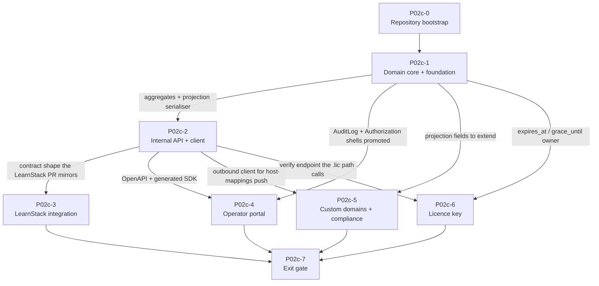

# Hub Roadmap

LearnStack Hub is the **control plane** for LearnStack: tenant lifecycle, plan catalogue, subscriptions, the entitlement projection, custom-domain administration, licence issuance, and the operator portal. It holds tenant _metadata_ and never tenant _content_.

**This directory is the authoritative plan for Hub work.** LearnStack's [Phase 02c](https://github.com/HodeTech/LearnStack/blob/main/docs/roadmap/phase-02c-hub-foundation.md) covers only LearnStack's side of the boundary — the `HubEntitlementProvider` / `IUsageReporter` / `IHubTenantSync` adapters and the `/api/internal/*` handlers — and points here for everything Hub-side. Cross-cutting decisions (ADRs, engineering standards) remain LearnStack's; see [Where cross-cutting authority lives](#where-cross-cutting-authority-lives).

## How this plan is governed

- **Hub is a demand-gated track, not a prerequisite.** LearnStack runs on `NullEntitlementProvider` and resolves hosts from `platform_host_to_tenant` until a tenant must be billed or plan-gated. That sentence is the literal trigger condition [ADR-0035](https://github.com/HodeTech/LearnStack/blob/main/docs/decisions/0035-demand-gated-infrastructure.md) records for the Hub entitlement adapter. It is the **first** of two conditions that resume this plan; the second is that the contract surface is built against [ADR-0034](https://github.com/HodeTech/LearnStack/blob/main/docs/decisions/0034-hub-contract-surface-invariant.md)'s two invariants rather than an endpoint count. Both are stated in [CLAUDE.md](../../CLAUDE.md) and in [The freeze](#the-freeze).
- **The `P02c-N` identifiers are stable and load-bearing.** They appear in branch names, commit subjects, skill bodies, design specs, CI comments, and in LearnStack's roadmap. They are not renumbered, and `P02c-3` in this repo means the same packet as `P02c-3` in LearnStack's.
- **Every packet doc carries the same six sections** — `## Goal`, `## Scope`, `## Deliverables`, `## Completion Criteria`, `## Risks`, `## Phase Exit Decision` — matching LearnStack's roadmap convention.
- **No owners, no effort estimates, no timeboxes.** This is a dependency and scope plan. Sequencing decisions belong here; capacity decisions do not.

## Packets

| Packet                                                     | Title                                                    | State                             |
| ---------------------------------------------------------- | -------------------------------------------------------- | --------------------------------- |
| [**P02c-0**](p02c-0-repository-bootstrap.md)               | Repository bootstrap                                     | ✅ Shipped                        |
| [**P02c-1**](p02c-1-hub-domain-core.md)                    | Hub domain core + Hub cross-cutting foundation           | ✅ Shipped — reconciliations owed |
| [**P02c-2**](p02c-2-internal-api-and-contract.md)          | Internal API handlers + outbound `LearnStackApiClient`   | ⏸ Frozen — [ADR-0035 trigger](#the-freeze) |
| [**P02c-3**](p02c-3-learnstack-integration.md)             | LearnStack integration (cross-repo, two coordinated PRs) | ⏸ Frozen — also [blocked](#hub-waits-on-learnstack) |
| [**P02c-4**](p02c-4-operator-portal.md)                    | Operator portal MVP + Operators + Audit modules          | ⏸ Frozen                          |
| [**P02c-5**](p02c-5-custom-domain-lifecycle.md)            | Custom-domain lifecycle + Compliance module              | ⏸ Frozen                          |
| [**P02c-6**](p02c-6-license-key.md)                        | Licence key (functional skeleton)                        | ⏸ Frozen                          |
| [**P02c-7**](p02c-7-exit-gate.md)                          | End-to-end exit gate                                     | ⏸ Frozen                          |

### The freeze

P02c-1 is **merged**. Everything after it is frozen by owner decision (2026-08-08), on the
[ADR-0035](https://github.com/HodeTech/LearnStack/blob/main/docs/decisions/0035-demand-gated-infrastructure.md)
trigger for `IEntitlementProvider`: **a tenant must be billed or plan-gated**. Until then
LearnStack runs on `NullEntitlementProvider` and consumes nothing from the Hub, so building
P02c-2's contract surface would be building against a boundary with no caller.

P02c-1 merged rather than waiting because its domain code conflicts with none of the three
decisions that moved: the entitlement wire shape already carries `grace_until` and
`generation`, no endpoint is hosted, and `AuditLogBehavior` is a shell that writes nothing.
Freezing the artefact would have cost the SharedKernel reconciliation against LearnStack
Packet 3b, which grows with every packet built on top.

### Reconciliations owed on the merged P02c-1

Tracked here rather than in the packet document, because they are follow-ups on shipped
code and P02c-1's own record is closed:

- **Audit seam (ADR-0033).** `AuditLogBehavior` is step 3 and wraps `TransactionBehavior`;
  its success-path TODO writes after commit. ADR-0033 puts the MUST-class write on the
  ambient transaction immediately before `COMMIT`. Nothing misbehaves today — the behavior
  writes nothing — but the TODO specifies the superseded shape. Lands with the Audit
  module in P02c-4.
- **SharedKernel vs LearnStack Packet 3b.** The mirrored kernel inherited all three
  defects Packet 3b exists to repair: `Results.Unit` colliding with `MediatR.Unit`, missing
  `[MemberNotNullWhen]` on `Result<T>`, and `Entity<TId>` boxing on every equality check.
  Unlike LearnStack, the Hub already has four modules of consumers, so this grows with
  each packet.

### Deferred from P02c-1 (tracked follow-ups)

- ⏳ **Roslyn `DomainException` analyzer** (`LearnStack.Hub.Analyzers`) — deferred per cross-cutting-foundation.md § 5; the `DomainException`-vs-`Result.Fail` rule rides code review until then. Target: P02c-2.
- ⏳ **EF-Core OpenTelemetry instrumentation** (`AddEntityFrameworkCoreInstrumentation`) — the only published package is a 1.x-beta whose `OpenTelemetry.Api` floor conflicts with the stable 1.15.x instrumentation set; reserved in `Directory.Packages.props`. Target: P02c-2.
- ⏳ **Feature/limit registry sync** — Hub seeds `FeatureKeys`/`LimitKeys` from the projection wire-shape (Architecture 24 § 4); a cross-repo reconciliation with LearnStack core's registry (or a shared `LearnStack.Contracts` package) is the durable fix. Target: Phase 11.
- ⏳ **SQL keyset pagination** — list repositories slice in memory in P02c-1 (tiny volume); promote to `ORDER BY ... WHERE id > cursor` when volume warrants.

## Dependency on LearnStack core packets

Execution artifacts live alongside the packet docs: [`P02c-1-implementation-prompt.md`](P02c-1-implementation-prompt.md) is the kickoff prompt the P02c-1 agent ran against.

## Post-MVP tracks

These are Hub-owned phases that sit outside the P02c series. LearnStack's [Phase 09b](https://github.com/HodeTech/LearnStack/blob/main/docs/roadmap/phase-09b-hub-billing.md) and [Phase 12](https://github.com/HodeTech/LearnStack/blob/main/docs/roadmap/phase-12-hub-marketplace.md) are pointers at them.

| Track                                    | What it covers                                                                                         | Trigger                      |
| ---------------------------------------- | ------------------------------------------------------------------------------------------------------ | ---------------------------- |
| [Hub Billing](hub-billing.md)            | Stripe / Iyzico adapters, `Invoicing` module, `WebhookLedger`, dunning, proration, the storefront flow | Commercial billing is needed |
| [Hub Marketplace](hub-marketplace.md)    | Shared customization packages, listing, install — free-only; paid listings and revenue splits are out of the roadmap | Demonstrated cross-tenant duplication **and** an accepted ADR resolving the ADR-0034 collision |
| Hub Operations (unscheduled)             | Hub production deployment, HA topology, backup and restore drill, release process, and the operational runbooks the [P02c-7](p02c-7-exit-gate.md) gate names | A Hub instance serves a paying tenant |

Hub Operations has no plan document yet. It is listed so the work has a named owner in this repository rather than being handed to LearnStack Phase 11, which scopes itself to LearnStack ([Phase 11 § Release Engineering](https://github.com/HodeTech/LearnStack/blob/main/docs/roadmap/phase-11-production-hardening.md)).

## Intra-Hub dependency map

**Reading the map**, for renderers without Mermaid:

- **P02c-0 → P02c-1.** The bootstrap ships empty projects; P02c-1 fills them.
- **P02c-1 → P02c-2.** The internal API serves the `Entitlement` projection and the `Plan` / `HubSubscription` aggregates P02c-1 creates. P02c-2 also promotes P02c-1's `OutboxFlushBehavior` shell to a live `IOutbox` flush — until then there is nothing to publish.
- **P02c-1 → P02c-4.** The operator portal reads the four aggregates, and P02c-4 promotes the other two P02c-1 pipeline shells: `AuditLogBehavior` gains the operator-audit writer and `AuthorizationBehavior` gains the operator permission check. Both are registration-order-only in P02c-1.
- **P02c-1 → P02c-5 / P02c-6.** `CompliancePolicy` fills the projection's `compliance_caps`, which P02c-1 ships as an empty JSONB shape; licence issuance fills `expires_at` / `grace_until`, which P02c-1 leaves null.
- **P02c-2 → P02c-3.** The Hub PR carries the canonical contract shape; the LearnStack PR is written against it.
- **P02c-2 → P02c-4.** The portal consumes the generated SDK produced from P02c-2's OpenAPI document.
- **P02c-2 → P02c-5.** The host-mapping push uses the outbound `LearnStackApiClient`. P02c-2 builds the client with no caller for that path; P02c-5 is the caller.
- **P02c-3 … P02c-6 → P02c-7.** The exit gate rehearses the full SaaS and Self-Hosted scenarios end to end, so it gates on every preceding packet.

## Cross-repo blocking

Both repositories block each other in places. Neither table is a wish list — every row names the artefact that unblocks it.

### Hub waits on LearnStack

| Hub packet | LearnStack packet                                                                             | What it provides                                                                                                         |
| ---------- | --------------------------------------------------------------------------------------------- | ------------------------------------------------------------------------------------------------------------------------ |
| P02c-3     | [P02a-5 Foundation ports](https://github.com/HodeTech/LearnStack/blob/main/docs/roadmap/phase-02a-kernel-tenancy.md)       | `IEventBus` / `ICacheService` / `ISecretProvider` and their default implementations, which the LearnStack-side handlers use |
| P02c-3     | [P02a-6 Tenancy schema](https://github.com/HodeTech/LearnStack/blob/main/docs/roadmap/phase-02a-kernel-tenancy.md)         | `platform_entitlement_cache`, `platform_host_to_tenant` and `outbox_messages` tables                                     |
| P02c-3     | [P02a-7 Resolution + isolation](https://github.com/HodeTech/LearnStack/blob/main/docs/roadmap/phase-02a-kernel-tenancy.md) | `IHostToTenantResolver`, `TenantResolverMiddleware`, and the `HubCorrelationMiddleware` seam that populates `ITenantContext` on `/api/internal/*` |
| P02c-3     | [P02a-9 Audit + entitlement socket](https://github.com/HodeTech/LearnStack/blob/main/docs/roadmap/phase-02a-kernel-tenancy.md) | The `IEntitlementProvider` socket with `NullEntitlementProvider` as its only implementation                            |
| P02c-3     | [Phase 02b Identity Integration + Events](https://github.com/HodeTech/LearnStack/blob/main/docs/roadmap/phase-02b-events-auth.md) | The `OutboxProcessor` and its claim protocol, `IInboxGuard` and the per-module `inbox_messages` tables, and handler-scope tenant-context restoration. `IUsageReporter` dispatches through the outbox rather than inline, and the `learnstack.hub.entitlement` invalidation consumer is an ordinary `IIntegrationEventHandler<T>` behind the same inbox guard |
| P02c-6     | [P02a-9 Audit + entitlement socket](https://github.com/HodeTech/LearnStack/blob/main/docs/roadmap/phase-02a-kernel-tenancy.md) | The `IEntitlementProvider` socket the LearnStack-side `SignedLicenseKeyEntitlementProvider` skeleton plugs into, in a coordinated pull request |
| P02c-5     | [LearnStack Phase 02c](https://github.com/HodeTech/LearnStack/blob/main/docs/roadmap/phase-02c-hub-foundation.md) | The LearnStack-side `host-mappings` handler and its `platform_host_to_tenant` mirroring — the paired half of this packet, merged in the same session |
| P02c-5     | [LearnStack Phase 11](https://github.com/HodeTech/LearnStack/blob/main/docs/roadmap/phase-11-production-hardening.md) | The LearnStack **edge** half only: certificate installation at the gateway, demand-gated per [ADR-0035](https://github.com/HodeTech/LearnStack/blob/main/docs/decisions/0035-demand-gated-infrastructure.md). P02c-5 does **not** wait on it — host resolution works from the `platform_host_to_tenant` row alone |

P02c-0 and P02c-1 have shipped. Of what remains, **P02c-2 and P02c-4 are unblocked by LearnStack** — they touch no LearnStack code and can proceed as soon as the Hub track resumes. P02c-3, P02c-5 and P02c-6 each land as two coordinated pull requests; see the tables above and [Coordination protocol](#coordination-protocol). P02c-3 is the only packet gated on the LearnStack spine reaching **Phase 02b**, not merely Phase 02a.

### LearnStack waits on Hub

| LearnStack artefact                                             | Hub packet | Why                                                                                                                                    |
| ----------------------------------------------------------------- | ---------- | ---------------------------------------------------------------------------------------------------------------------------------------- |
| `entitlement-v1.schema.json` + its snapshot test                 | P02c-1     | The schema is born with the Hub projection serialiser. Both repositories check in the same file and assert it independently.            |
| `HubEntitlementProvider` (Phase 02c)                             | P02c-2     | The last hop of the entitlement read path in [ADR-0034](https://github.com/HodeTech/LearnStack/blob/main/docs/decisions/0034-hub-contract-surface-invariant.md) is `POST /api/v1/internal/license/verify`, which is a Hub handler. |
| `IUsageReporter` (Phase 02c)                                     | P02c-2     | Needs `POST /api/v1/usage/report` live, with its idempotency semantics fixed Hub-side.                                                  |
| LearnStack `/api/internal/*` handlers (Phase 02c)                | P02c-2     | The Hub PR carries the canonical request / response shapes and the mTLS + JWT + HMAC chain the handlers validate against.               |
| `NullEntitlementProvider_NotRegistered_OutsideDevelopment`       | P02c-3     | The rule is vacuous until a second `IEntitlementProvider` implementation exists.                                                        |
| `platform_host_to_tenant` mirror handler (Phase 02c)            | P02c-5     | The Hub is the certificate issuer and authors the `PUT /api/internal/tenants/{id}/host-mappings` payload shape.                         |
| `SignedLicenseKeyEntitlementProvider` skeleton                    | P02c-6 (coordinated LearnStack PR) | Needs the `.lic` format, the claim set, and the `kid`-addressed public key set the Self-Hosted instance ships with. Hardened later in [LearnStack Phase 11](https://github.com/HodeTech/LearnStack/blob/main/docs/roadmap/phase-11-production-hardening.md). |

### Coordination protocol

A packet that changes both repositories lands as two pull requests in one session: the Hub PR opens first and carries the canonical contract shape, the LearnStack PR references the Hub PR's commit hash, and both merge together. A one-sided merge leaves the contract dangling. [P02c-3](p02c-3-learnstack-integration.md) is the packet where this matters most and states the protocol in full.

## Status ledger

**Updated 2026-08-08.** This ledger tracks the state of _artefacts_, not commits. A row changes when the artefact changes state, not when a commit touches it — the previous commit-bound version of this file went stale four commits after it was written.

| Artefact                                                | State                    | Where                                                                                                                                                                                                                       |
| ------------------------------------------------------- | ------------------------ | ----------------------------------------------------------------------------------------------------------------------------------------------------------------------------------------------------------------------------- |
| Repository bootstrap                                    | Shipped on `main`        | [p02c-0-repository-bootstrap.md](p02c-0-repository-bootstrap.md)                                                                                                                                                            |
| Hub agent skill catalogue (18 skills)                   | Shipped on `main`        | [`.claude/skills/README.md`](../../.claude/skills/README.md)                                                                                                                                                                |
| Hub architecture design specs (3)                       | Shipped on `main`        | [module-topology](../architecture/module-topology.md), [cross-cutting-foundation](../architecture/cross-cutting-foundation.md), [entitlement-projection](../architecture/entitlement-projection.md)                           |
| Hub module design specs (4)                             | Shipped on `main`        | [tenant-lifecycle](../modules/tenant-lifecycle.md), [plans](../modules/plans.md), [subscriptions](../modules/subscriptions.md), [entitlements](../modules/entitlements.md)                                                   |
| P02c-1 implementation prompt                            | Shipped on `main`        | [P02c-1-implementation-prompt.md](P02c-1-implementation-prompt.md)                                                                                                                                                          |
| P02c-1 implementation                                   | **Shipped on `main`**    | Merged 2026-08-09, ~222 files. Two reconciliations owed on the merged code — the SharedKernel against LearnStack Packet 3b, and the audit seam against ADR-0033 — both listed in [p02c-1-hub-domain-core.md](p02c-1-hub-domain-core.md). |
| Hub roadmap (this directory)                            | Authoritative            | This file plus the eight packet docs                                                                                                                                                                                        |
| P02c-2 and everything after it                          | **Frozen**, not started  | Owner decision 2026-08-08. Resumes on the ADR-0035 trigger — see [The freeze](#the-freeze).                                                                                                                                  |

Known reconciliations still open, each named in its owning packet doc so it cannot be lost:

- ~~The `backend-integration` CI job's owning packet.~~ **Closed 2026-08-09.** P02c-1 shipped the first Testcontainers-backed tests and activated the job with them, which is the correct assignment; the three files on `main` that said P02c-2 were written when P02c-1 was expected to ship without integration tests, and are corrected.
- Operator-portal naming: **closed 2026-08-08.** LearnStack's `docs/` corpus now says `operator-portal` everywhere. Three residues remain outside it and are tracked rather than open: `frontend/README.md` and `frontend/apps/web/README.md` still say `learnstack-hub-web`, and [ADR-0015](https://github.com/HodeTech/LearnStack/blob/main/docs/decisions/0015-api-gateway-apisix.md) § Frontend apps says `apps/hub-web` — a third spelling, corrected by the next PR that touches that ADR. LearnStack's frozen [Phase 01](https://github.com/HodeTech/LearnStack/blob/main/docs/roadmap/phase-01-repository-tooling.md) record keeps the old name deliberately, annotated in place. The Keycloak client id `learnstack-hub-web` is an OIDC identifier, not an app name, and does not change.
- Feature-key / limit-key registry drift between the two repositories, which each keep their own copy. Recorded in [plans.md § Registry sync](../modules/plans.md).

## Where cross-cutting authority lives

Hub does not maintain its own standards corpus and does not restate LearnStack's decisions. Each row below is a single source of truth; if anything in this repository contradicts one, this repository is what gets fixed.

| Topic                                                | Authority                                                                                                        |
| ---------------------------------------------------- | ------------------------------------------------------------------------------------------------------------------ |
| The Hub boundary, separate repository, internal API  | [ADR-0019](https://github.com/HodeTech/LearnStack/blob/main/docs/decisions/0019-learnstack-hub.md)                                            |
| Contract-surface invariants + the real endpoint set  | [ADR-0034](https://github.com/HodeTech/LearnStack/blob/main/docs/decisions/0034-hub-contract-surface-invariant.md)                            |
| What ships now versus on demand, and the triggers    | [ADR-0035](https://github.com/HodeTech/LearnStack/blob/main/docs/decisions/0035-demand-gated-infrastructure.md)                                |
| Deployment modes + hybrid licence                    | [ADR-0020](https://github.com/HodeTech/LearnStack/blob/main/docs/decisions/0020-triple-deployment-hybrid-license.md)                           |
| Entitlement projection shape                         | [ADR-0021](https://github.com/HodeTech/LearnStack/blob/main/docs/decisions/0021-feature-based-entitlement.md)                                  |
| Custom domain + TLS                                  | [ADR-0022](https://github.com/HodeTech/LearnStack/blob/main/docs/decisions/0022-custom-domain-tls.md)                                          |
| Two-realm Keycloak boundary                          | [ADR-0004](https://github.com/HodeTech/LearnStack/blob/main/docs/decisions/0004-authentication-strategy.md)                                    |
| Exception handling, logging, observability           | [ADR-0032](https://github.com/HodeTech/LearnStack/blob/main/docs/decisions/0032-exception-handling-logging-and-observability.md)               |
| Engineering standards                                | [Standards corpus](https://github.com/HodeTech/LearnStack/blob/main/docs/standards/README.md)                                                  |
| Architecture-test identifiers                        | [Standards 21](https://github.com/HodeTech/LearnStack/blob/main/docs/standards/21-architecture-tests-catalogue.md)                             |
| Hub-internal decisions only                          | [`docs/decisions/`](../decisions/README.md) — the `HUB-NNNN` series                                               |

> **One correction worth stating explicitly.** [ADR-0034](https://github.com/HodeTech/LearnStack/blob/main/docs/decisions/0034-hub-contract-surface-invariant.md) replaces the "the Hub contract surface is closed at four endpoints" rule with two invariants: the Hub stores no tenant content, and every LearnStack↔Hub crossing goes through a named adapter. Adding an endpoint still requires an ADR. Pointer text elsewhere in this repository that still says "four endpoints" predates that ADR and is corrected as those files are touched.
