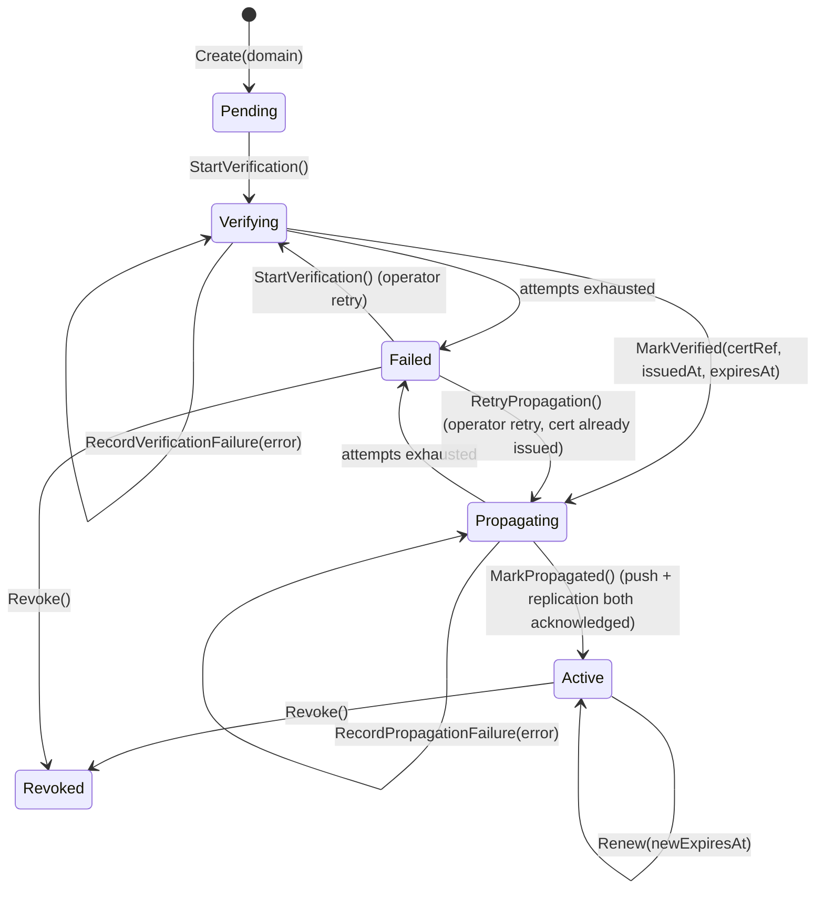

# P02c-5: Custom Domain Lifecycle

> **Status: ⏳ Not started.** Depends on [P02c-1](p02c-1-hub-domain-core.md) and [P02c-2](p02c-2-internal-api-and-contract.md). **Cross-repo** — the LearnStack-side `host-mappings` handler ships in [LearnStack Phase 02c](https://github.com/HodeTech/LearnStack/blob/main/docs/roadmap/phase-02c-hub-foundation.md) in a coordinated pull request; TLS termination at the LearnStack edge is [Phase 11](https://github.com/HodeTech/LearnStack/blob/main/docs/roadmap/phase-11-production-hardening.md) and this packet does not wait on it.

## Goal

Let a tenant run under its own domain, and make the whole path — submission, ownership
proof, certificate issuance, renewal, revocation — an automated Hub workflow rather than
an operator editing a route file.

Education platforms compete on brand. A yoga studio does not want its learners typing
`anatolia-yoga.learnstack.app`; the domain is part of the product
([ADR-0022](https://github.com/HodeTech/LearnStack/blob/main/docs/decisions/0022-custom-domain-tls.md)). But the
mechanism that delivers that domain is the single most security-sensitive thing the Hub
does: it handles ACME challenges, private keys, and the mapping that decides which
tenant's data a request sees. P02c-5 builds it under two hard constraints that
[ADR-0034](https://github.com/HodeTech/LearnStack/blob/main/docs/decisions/0034-hub-contract-surface-invariant.md)
makes explicit — **certificate material never travels in the entitlement payload**, and
**the Hub never holds Kubernetes credentials on the LearnStack cluster**.

This packet also lands the `Compliance` module, because compliance caps are the second
input the entitlement projection has been carrying as an empty `{}` since P02c-1, and
both belong to the same "per-tenant policy an operator sets" surface.

## Scope

### `CustomDomain` aggregate and state machine

`LearnStack.Hub.Modules.CustomDomains` owns `CustomDomain : AuditableEntity<CustomDomainId>`,
shaped as [ADR-0022 § Hub data model](https://github.com/HodeTech/LearnStack/blob/main/docs/decisions/0022-custom-domain-tls.md)
specifies.

States: `Pending | Verifying | Propagating | Active | Failed | Revoked`. Text fallback — a
submitted domain is `Pending`; verification moves it to `Verifying`, where failures
accumulate until the attempt budget is exhausted (`Failed`) or the challenge succeeds.
A successful challenge does **not** reach `Active`: it moves to `Propagating`, where the
domain waits on both halves of § Propagation — the `PUT .../host-mappings` push
acknowledged by LearnStack, and the certificate replication into the LearnStack-owned
secret store acknowledged by the secret store. Only when both acknowledge does
`MarkPropagated()` move it to `Active`, and only that transition emits
`learnstack.hub.custom-domain.activated`. The intermediate state exists because
`Verifying → Active` on a certificate alone is exactly the split brain the § Risks entry
names: a domain that resolves but does not serve. An active domain renews in place and can
be revoked; a failed domain is retried by an operator — re-verifying if the challenge
failed, re-propagating if only the push or the replication did — or revoked.

Every transition is a method returning `Result` and emitting a domain event. Invalid
transitions return `Result.Fail(business_rule_violation)` and never throw
`DomainException`.

Validation at `Create`:

- FQDN format, no scheme, no port, no wildcard.
- The registrable domain is checked against the bundled Mozilla **public suffix list** — a
  tenant cannot claim `com`, `co.uk` or `gov.tr`.
- `ux_custom_domains_domain` — a host belongs to exactly one tenant at a time, enforced by
  a unique index rather than by application check, because the failure mode of a duplicate
  is one tenant serving another tenant's traffic.
- One `is_primary` domain per tenant.
- The `tenancy.custom_domain` feature key must be present in the tenant's entitlement
  ([ADR-0021](https://github.com/HodeTech/LearnStack/blob/main/docs/decisions/0021-feature-based-entitlement.md)); the
  gate is checked at submission, not at activation, so a tenant is told immediately.

Per [ADR-0022 § Architecture tests](https://github.com/HodeTech/LearnStack/blob/main/docs/decisions/0022-custom-domain-tls.md),
`CustomDomain_TenantId_NeverReadFrom_RequestBody` — the tenant is always derived from the
authenticated context, never from a submitted field.

### Challenge runner

- **DNS-01 by default.** The Hub publishes the `_acme-challenge.{domain}` TXT record
  through the tenant's DNS provider API where one is configured, or renders the record for
  the tenant to add manually and polls for it.
- **HTTP-01 as fallback**, for tenants that cannot delegate DNS. This path requires the
  CNAME to already point at the LearnStack edge, which makes the first issuance
  order-dependent: the tenant must cut over DNS before the certificate exists, so the
  first request after cutover and before issuance fails. The submission UI states this
  ordering; DNS-01 has no such problem, which is why it is the default rather than a
  preference.
- A Hangfire recurring job runs the verification poll with a bounded attempt budget and
  backoff (ADR-0022's default: every 60 seconds, up to 60 attempts). **What it polls is
  selected by the domain's challenge mode**, not fixed: the default DNS-01 flow queries the
  `_acme-challenge.{domain}` TXT record and compares it against the expected token, while
  the HTTP-01 fallback resolves the domain's CNAME and checks that it points at the
  LearnStack edge. A job that only ever did one of the two would silently never succeed for
  domains in the other mode. `VerificationAttempts` and `LastVerificationError` are on the
  aggregate so the operator queue can show *why* a domain is stuck, not just that it is.
- A second recurring job renews certificates inside their 30-day pre-expiry window.

### `ITlsCertificateProvider` and the ACME adapter

- Port `ITlsCertificateProvider` in `LearnStack.Hub.SharedKernel` — `IssueAsync`,
  `RenewAsync`, `RevokeAsync`, all in terms of a domain name and an opaque certificate
  reference. No ACME type crosses the port.
- Adapter `LearnStack.Hub.Infrastructure.Acme` wraps the Let's Encrypt / ACME client and
  translates SDK exceptions into `ProviderException` at the boundary, per the standing
  rule that provider SDK exception types never leave their adapter assembly.
- Rate limiting is modelled explicitly rather than folded into "transient failure":
  Let's Encrypt's per-registered-domain and duplicate-certificate limits are weekly
  windows, so a retry inside the window cannot succeed. The adapter surfaces a distinct
  rate-limited outcome; the resilience decorator does not retry it, and the job defers to
  the next day and raises an operator alert.
- `IProviderResilience<ITlsCertificateProvider>` supplies retry, circuit breaker, timeout
  and bulkhead from `appsettings.Resilience:tls:`.
- Development and CI run against an **ACME staging directory** (Pebble or the Let's
  Encrypt staging endpoint). No test consumes production issuance quota, and no test
  produces a publicly trusted certificate.

### Integration events

Published through `IOutbox` → `IEventBus` on the topics
[ADR-0022 Amendment 1](https://github.com/HodeTech/LearnStack/blob/main/docs/decisions/0022-custom-domain-tls.md)
names:

| Topic | Emitted when | LearnStack-side effect |
|---|---|---|
| `learnstack.hub.custom-domain.activated` | `MarkPropagated` succeeds — i.e. on entering `Active`, after both the host-mapping push and the certificate replication have acknowledged. Never on `MarkVerified` alone | **Invalidate** the resolver cache entry for the host. The mapping itself arrives over `PUT /api/internal/tenants/{id}/host-mappings` — see § Propagation below |
| `learnstack.hub.custom-domain.deactivated` | `Revoke` succeeds | **Invalidate** the resolver cache entry for the host. The row is removed by the same push endpoint |
| `learnstack.hub.custom-domain.renewed` | `Renew` succeeds | Refresh the certificate reference; no mapping change |

Each payload carries the host, the tenant id, the optional organization id, and a
**reference** to the certificate — never the certificate.

### Propagation — the part ADR-0034 changed

This is the load-bearing section of the packet.

[ADR-0022 Amendment 1](https://github.com/HodeTech/LearnStack/blob/main/docs/decisions/0022-custom-domain-tls.md)
routed host mappings, and with them TLS certificate material including private keys,
through `PUT /api/internal/tenants/{id}/entitlements` — because that kept the contract
surface at four endpoints. The entitlement payload is cached in
`platform_entitlement_cache`, logged, audited and mirrored. Tunnelling a private key
through a cached projection is strictly worse than declaring another endpoint, and
[ADR-0034](https://github.com/HodeTech/LearnStack/blob/main/docs/decisions/0034-hub-contract-surface-invariant.md)
supersedes that step.

Two channels, with different trust properties:

1. **Host mappings — over HTTP.**
   `PUT /api/internal/tenants/{id}/host-mappings` carries the host →
   `(tenant_id, organization_id?)` tuple and a **secret-store path** identifying where the
   certificate lives. It carries no certificate, no private key, and no chain. It is
   cacheable, loggable and auditable precisely because everything in it is safe to cache,
   log and audit.
2. **Certificate material — by secret-store replication.**
   The Hub writes the issued certificate and key into the **Hub-owned** secret store under
   `learnstack-hub/certs/{domain}`. It is replicated into the **LearnStack-owned** secret
   store at the path named in the host-mapping payload. LearnStack's edge materialises it
   from its own store. The material never transits an application payload in either
   direction, and neither side reads the other's store directly.

Consequences that must stay true:

- `PUT /api/internal/tenants/{id}/entitlements` carries **no** host fields and **no**
  certificate fields. `entitlement-v1.schema.json` sets `additionalProperties: false` so a
  future convenience field cannot be added without failing the snapshot test in both
  repositories.
- The Hub holds **no** Kubernetes credential on the LearnStack cluster. The route partial,
  the APISIX SSL object and the Vault Agent annotation are all written inside the
  LearnStack-owned cluster, by LearnStack code, reacting to the event and the push. This
  guarantee is unchanged from ADR-0022 Amendment 1; only the transport for the material
  changed.
- `Cert_PrivateKey_NeverLeavesVault_To_Logs` (ADR-0022) applies to Hub code as well as
  LearnStack code: the log redaction filter strips any string containing a PEM private-key
  header before emission.

### Host resolution never calls the Hub

LearnStack's `IHostToTenantResolver` reads `platform_host_to_tenant` and nothing else.
`IHubClient.LookupHostAsync` does not exist and must not be reintroduced.

The reason is availability, not purity: host resolution runs on every anonymous public
page load. A resolver that calls the Hub on a cache miss puts the control plane on the hot
path of every tenant's marketing site, so a Hub deployment takes tenant homepages down
with it. The mapping is pushed, cached durably in a LearnStack-owned table, and read
locally.

### `Compliance` module

`LearnStack.Hub.Modules.Compliance` ships `CompliancePolicy` — the per-tenant caps that
merge with the plan's `compliance_defaults` into the projection's `compliance.caps` block.

- Cap shape is `{ allowed, forced, value? }`, not a bare boolean, per
  [entitlement-projection.md § Key-shape rules](../architecture/entitlement-projection.md).
- A `CompliancePolicy` change is a recompute trigger — the row marked `⏳ P02c-5` in that
  document's trigger table becomes live here, and `generation` increments like any other
  input change.
- Caps are the sanctioned answer to "make this one tenant behave differently". They are an
  **input** to the projection, which is why they exist and why the entitlement viewer in
  [P02c-4](p02c-4-operator-portal.md) stays read-only.

### Operator portal screens

Added to the P02c-4 shell: Custom Domains → Pending Queue, Active List, Renewal Watch
(certificates expiring within 30 days), and Compliance → Caps Editor.

### What ships on the LearnStack side, and what does not

The LearnStack-side event consumer, the `host-mappings` handler and the
`platform_host_to_tenant` writes are the paired half of this packet and live in LearnStack
[Phase 02c](https://github.com/HodeTech/LearnStack/blob/main/docs/roadmap/phase-02c-hub-foundation.md). They land as
two pull requests in one session, per [CLAUDE.md § Cross-repo coordination](../../CLAUDE.md):
the **Hub pull request opens first** and carries the canonical contract shape, the
**LearnStack pull request references the Hub PR's commit hash** and is written against
that shape, and **both merge in the same session** — either-side merge alone leaves the
contract dangling.

The LearnStack **edge** half is demand-gated. Per
[ADR-0035](https://github.com/HodeTech/LearnStack/blob/main/docs/decisions/0035-demand-gated-infrastructure.md), both
the APISIX adapter and custom-domain TLS automation land in
[LearnStack Phase 11](https://github.com/HodeTech/LearnStack/blob/main/docs/roadmap/phase-11-production-hardening.md),
on their two **separate** triggers — TLS automation on *"a tenant needs its own domain in
production"*, APISIX on *"a non-dev deployment needs edge rate limiting, host routing, or
JWT pre-validation"*. The first custom domain in production satisfies both, which is why
they land together, but they are two rows with two conditions and neither implies the
other. Before those triggers fire, LearnStack terminates TLS with its default ASP.NET
hosting rather than APISIX SSL objects.

The split is clean because routing and termination are separable: host **resolution**
works as soon as `platform_host_to_tenant` carries the row, so a request with a custom
`Host` header reaches the right tenant from this packet onward. What waits for Phase 11 is
serving that host on a publicly trusted certificate at the edge.

## Deliverables

- Inbound handler for `POST /api/v1/internal/tenants/{id}/custom-domains` — the submission
  hop LearnStack's Admin Studio proxies, because a `learnstack` realm token is rejected
  at the Hub ([ADR-0004](https://github.com/HodeTech/LearnStack/blob/main/docs/decisions/0004-authentication-strategy.md)). Enumerated in
  [ADR-0034 § The endpoint set](https://github.com/HodeTech/LearnStack/blob/main/docs/decisions/0034-hub-contract-surface-invariant.md).

  The LearnStack side of that hop goes through **`IHubTenantSync`** — the named adapter
  for tenant-administration crossings, and under ADR-0034's second invariant the only
  type on that side permitted to hold a Hub client for it. The Studio proxy calls the
  adapter; the adapter calls the Hub. `Hub_Client_Referenced_Only_By_Named_Adapters`
  fails the LearnStack build if anything else does. This packet's Hub pull request fixes
  the request and response contract — the submitted FQDN and challenge mode in, the
  created `CustomDomain` id and its initial state out — **before** the LearnStack-side
  adapter method is written against it, per the coordination protocol below.

- `LearnStack.Hub.Modules.CustomDomains` — aggregate, state machine, public-suffix
  validation, uniqueness constraints, commands and queries.
- `LearnStack.Hub.Modules.Compliance` — `CompliancePolicy`, cap merge into the projection,
  recompute trigger.
- `ITlsCertificateProvider` port plus the `LearnStack.Hub.Infrastructure.Acme` adapter,
  resilience-decorated, with a distinct rate-limited outcome.
- DNS-01 and HTTP-01 challenge runners; the verification recurring job covering **both**
  the TXT-record poll (DNS-01) and the CNAME check (HTTP-01); the renewal recurring job.
- `PUT /api/internal/tenants/{id}/host-mappings` on the outbound `LearnStackApiClient`,
  carrying host tuples and certificate references only.
- Secret-store replication path from `learnstack-hub/certs/{domain}` to the LearnStack-side
  path, with the LearnStack side referencing by path.
- The three `learnstack.hub.custom-domain.*` integration events.
- Operator portal: pending queue, active list, renewal watch, caps editor.
- Tests: unit tests for every state transition and every rejection at `Create`, including
  the `Propagating → Active` gate refusing to open on one acknowledgement; unit tests for
  the recurring job on **both** verification paths — the DNS-01 TXT poll and the HTTP-01
  CNAME check, each covering the found, absent and mismatched cases; an integration test
  issuing against an ACME staging directory end to end; a contract test asserting
  `entitlement-v1.schema.json` contains no host or certificate fields.

## Completion Criteria

- A domain submitted through the operator portal reaches `Active` against an ACME staging
  directory without an operator touching a configuration file.
- The host-mapping push lands a `platform_host_to_tenant` row in LearnStack, and a request
  carrying that `Host` header resolves to the correct tenant.
- The entitlement projection pushed for that tenant contains **no** certificate material
  and **no** host fields; the schema snapshot test proves it in both repositories.
- No Hub log line, audit row, span attribute or error-tracking envelope contains a PEM
  private-key header.
- Revoking the domain emits `.deactivated`, removes the mapping, and a request with that
  `Host` header no longer resolves to the tenant.
- A domain already registered to another tenant is rejected at submission by the unique
  index, not by a race-prone application check.
- A rate-limited issuance defers to the next day and raises an operator alert instead of
  burning retries inside the window.
- A `CompliancePolicy` change increments `generation` and appears in the tenant's
  projection.
- Hub architecture suite green, including `Hub_NeverStores_TenantData` —
  `CustomDomain` holds a hostname and a certificate reference, which are tenant metadata,
  not tenant content.

## Risks

- **Certificate material creeping back into the entitlement payload.** It is the shortest
  path, it worked once, and the reasoning that justified it is still in ADR-0022's
  amendment text. Mitigated by `additionalProperties: false` on the projection schema plus
  a snapshot test on both sides — the shortcut fails CI rather than review.
- **Host takeover across tenants.** Tenant A releases a domain, tenant B claims it, and a
  stale cached mapping serves B's traffic into A's data, or the reverse. Mitigated by the
  unique index on host, by `.deactivated` removing the mapping before a new `.activated`
  can be accepted for the same host, and by the resolver cache being invalidated on the
  deactivation event rather than by TTL expiry.
- **ACME rate limits discovered in production.** Failed-validation limits bite hardest
  during the first week of real customer onboarding, when misconfigured DNS is most
  common. Mitigated by the bounded attempt budget, by staging everywhere except
  production, and by surfacing `LastVerificationError` so an operator fixes the DNS
  instead of retrying the job.
- **HTTP-01's ordering trap.** The tenant must point DNS at the edge before a certificate
  exists, so there is a window of failed requests. Mitigated by defaulting to DNS-01 and
  by stating the ordering in the submission UI rather than in a runbook nobody reads.
- **Split-brain between the mapping table and the certificate store.** A mapping exists
  for a host whose certificate replication failed, so the host resolves but does not
  serve. Mitigated by making `Active` conditional on both the mapping push and the
  replication acknowledging, and by the renewal watch screen showing certificate state
  next to mapping state.
- **Air-gapped deployments have no Hub at all.** Customer-provided certificates placed
  directly in the customer's own secret store are the path there
  ([ADR-0022 Amendment 2](https://github.com/HodeTech/LearnStack/blob/main/docs/decisions/0022-custom-domain-tls.md)
  — its SaaS / Dedicated bullet is superseded by ADR-0034, the air-gapped half stands);
  none of this packet applies to `SelfHostedAirGapped`, and the `.lic` file's
  `custom_domains` claim is how that mode tells LearnStack which hosts to expect
  ([P02c-6](p02c-6-license-key.md)).

## Phase Exit Decision

P02c-5 is complete when a domain goes from submitted to serving without an operator
editing infrastructure, and when the two things ADR-0034 was written to protect are
demonstrably true: the entitlement payload is free of certificate material and host
fields, and no code path resolves a host by calling the Hub.

The packet does **not** exit on a green issuance alone. If the mapping is correct but a
private key appears in a log, or the entitlement schema quietly grew a `certificate`
field, the packet is not done — those are the failure modes it exists to prevent.

Next: [P02c-6 License Key](p02c-6-license-key.md).
